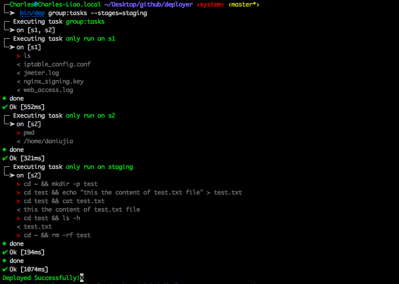

# Introduction

`deployer` is a deployment tool written in NodeJS with support for popular frameworks out of the box.

## Install 

```bash
$ npm install node-deployer -g
```

## Examples

Under your project, create a file `.deployer.js` where define your tasks. 

```js
// in .deployer.js

'use strict'

server('s1', '192.168.100.1', 22)
  .user('user')
  .identityFile('/Users/Charles/.ssh/id_rsa.pub', '/Users/Charles/.ssh/id_rsa', null)
  .stages(['dev'])
;

server('s2', '192.168.100.2', 22)
  .user('user')
  .identityFile('/Users/Charles/.ssh/id_rsa.pub', '/Users/Charles/.ssh/id_rsa', null)
  .stages(['staging'])
;

task('only run on s1', function () {
  return run('ls');
})
.onlyForServers('s1');

task('only run on s2', function() {
  return run('pwd');
})
.onlyForServers('s2');

task('only run on dev', function() {
  return run('cd ~ && mkdir -p test')
        .then(() => run('cd test && echo "this the content of test.txt file" > test.txt'))
        .then(() => run('cd test && cat test.txt'))
        .then(() => run('cd test && ls -h'))
        .then(() => run('cd ~ && rm -rf test'));
})
.onlyForStages('dev');

task('only run on staging', function() {
  return run('cd ~ && mkdir -p test')
        .then(() => run('cd test && echo "this the content of test.txt file" > test.txt'))
        .then(() => run('cd test && cat test.txt'))
        .then(() => run('cd test && ls -h'))
        .then(() => run('cd ~ && rm -rf test'));
})
.onlyForStages('staging');

task('group:tasks', [
  'only run on s1',
  'only run on s2',
  'only run on dev',
  'only run on staging'
]);
```

run command:

```bash
$ depl group:tasks --stages=staging
```

run `--help` or `-h` to see the usage.

result:



## How to use

### global functions

`node-deployer` have many global functions, you can use them to define task, server and so on.

- **server**(< *string* >serverName, < *string* >host, < *number* >port) - add a sevrer.
  
  `server()` return a `Builder` instance, you can config other options:

  + **server**(< *string* >host) - update server host.
  + **port**(< *number* >port) - update server port.
  + **user**(< *string* >user) - update the login username.
  + **password**(< *string* >password) - update the login password.
  + **stages**(< *string*|*array* >stages) - define the stages of this server.
  + **env**(< *string* >key, value) - define a env property.
  + **identityFile**(< *string* >publicKey, < *string* >privateKey, < *string* >passphrase) - define the ssh keys.

- **task**(< *string* >taskName, < *function*|*array* >) - add a task.

  `task()` return a `Task` instance, you can config some options:

  + **desc**(< *string* >desc) - task description.
  + **onlyForStages**(< *string* >stage, ...) - the task can run on which stage.
  + **onlyForServers****(< *string* >server, ...) - the task can run on which server.

## As a contributor

fork it, then clone project, finally run `gulp`.

